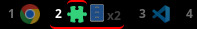
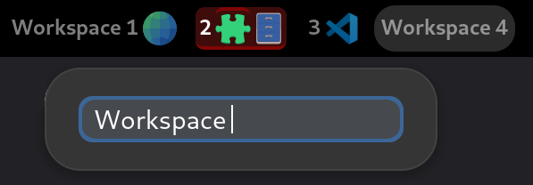
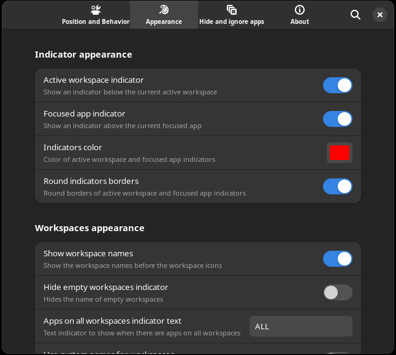

# Workspace indicator by open apps

**GNOME shell estension** to display a simple **workspace indicator** showing **icons of apps open** in it instead of classic numbers or dots.

## Features and Customization

- Show a simple indicator to display workspaces and the apps open in them
- Support for drag and drop: move an application to another workspace by dragging its icon
- Right- or left-click to focus or minimize an application; middle-click to close it
- Workspaces scrolling: change the active workspace by scrolling over the indicator
- Support for multiple monitors _(for both static and dynamic workspaces)_
- Rename workspaces directly from the extension _(enable in settings)_
- Hide or show the GNOME default workspace indicator (formerly the Activities button)
- Customize indicator position, size, color, and background
- Customize which elements are shown (indicator, empty workspaces, etc.)
- Icon style and saturation
- Show or hide window titles alongside icons
- Limit and group icons per workspace
- Ignore applications (using regular expressions)
- and many more in _extension preferences_

> [!TIP]
> Customize CSS editing `stylesheet.css` file. Add more classes simply searching `css_*` variables in `extension.js`.

> [!WARNING]
> Centering vertically the labels independently from the font used is problematic. Tweak `.wboa-label` classes in `stylesheet.css` to adjust it.

## Installation

Available for **GNOME 45+**: [gnome shell extensions store](https://extensions.gnome.org/extension/5967/workspaces-indicator-by-open-apps/).

> [!TIP]
> _Legacy versions (GNOME shell 40-44) available on gnome extensions store. These versions will not receive new updates._

### Manual installation

- Download the extension folder _(this repository)_
- Execute `./install.sh` _(requires sudo priviledges)_

### Useful commands

- Compile settings schema: `glib-compile-schemas ./schemas/`
- Show (all) extension(s) logs: `journalctl /usr/bin/gnome-shell -f -o cat`
- Show settings logs: `journalctl /usr/bin/gjs -f -o cat`
- List settings: `dconf dump  /org/gnome/shell/extensions/workspaces-indicator-by-open-apps/`
- Edit manually setting: `dconf write /org/gnome/shell/extensions/workspaces-indicator-by-open-apps/<setting> <value>`

## To Do

_See [issues](https://github.com/Favo02/workspaces-by-open-apps/issues) page._

## Contributions

_See [CONTRIBUTING.md](CONTRIBUTING.md) file._

## Credits

_See [CREDITS.md](CREDITS.md) file._
